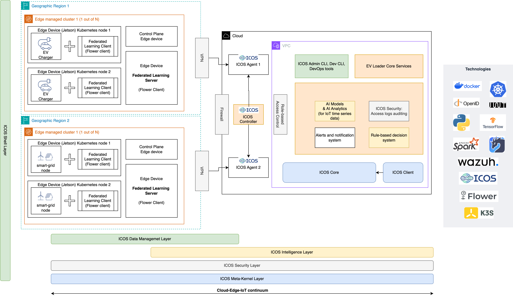
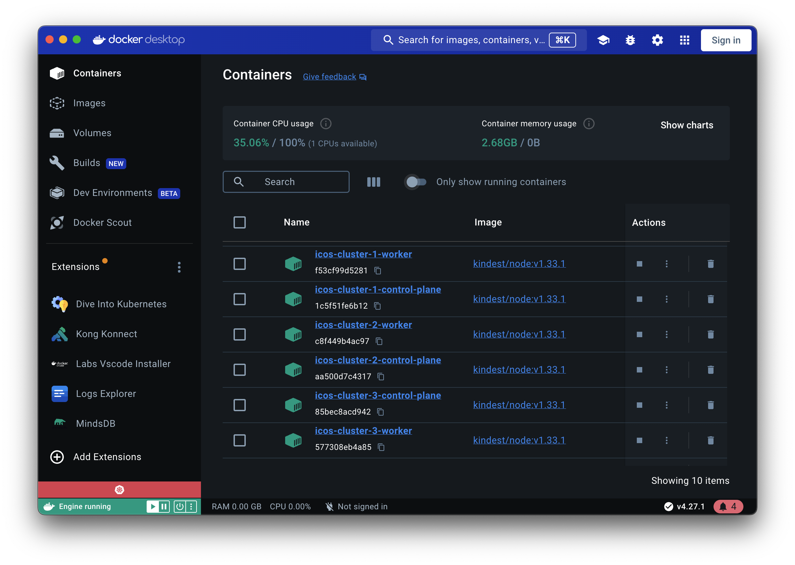

# ELM
Edge Load Management (ICOS)




## Testing with multiple clusters

Create controller cluster
```bash
kind create cluster --config controller-cluster.yaml -n icos-cluster-1
```

Create 2 agent clusters as show in the architecture diagram  
```bash
kind create cluster --config agent-cluster.yaml -n icos-cluster-2
kind create cluster --config agent-cluster2.yaml -n icos-cluster-3
```


Verify clusters
```bash
kind get clusters
```

use a cluster (e.g. to deploy helm charts)
```bash
kubectl cluster-info --context kind-icos-cluster-2
```

